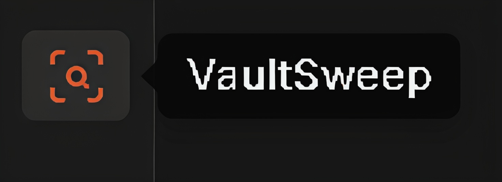
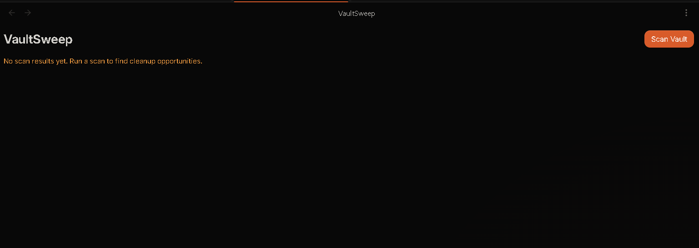
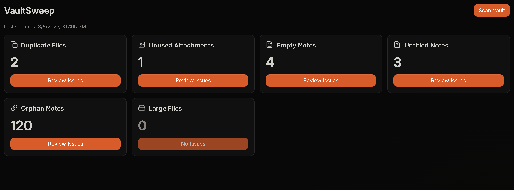
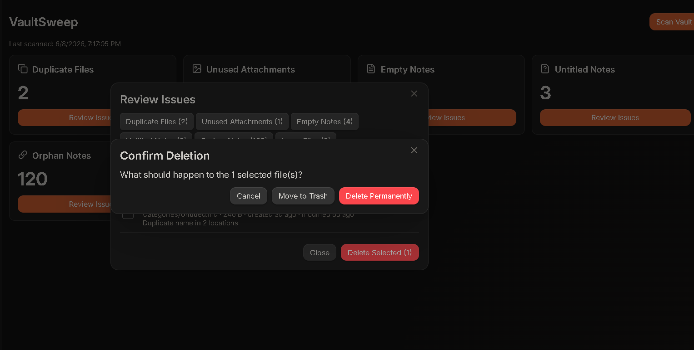

# VaultSweep

A safe cleanup and maintenance assistant for Obsidian.

VaultSweep scans your vault, creates a report of cleanup opportunities, and lets you decide what to do.

**VaultSweep never deletes files automatically.**

## Workflow

```text
SCAN → REPORT → REVIEW → USER DECISION → CLEAN
```

---

## Screenshots

### VaultSweep Ribbon Icon



### VaultSweep Dashboard



### Scan Results



### Issue Review



---

## Features

| Issue | What VaultSweep Finds |
|---|---|
| **Duplicate Files** | Same filename in different folders |
| **Unused Attachments** | Images, PDFs, ZIPs, and other files not used in your notes |
| **Empty Notes** | Notes with no useful content, links, or tasks |
| **Untitled Notes** | Notes such as `Untitled.md` or `New Note.md` |
| **Orphan Notes** | Notes with no links to or from other notes |
| **Large Files** | Files larger than your chosen size limit |

---

## Install

### Community Plugin

1. Open **Settings → Community plugins**
2. Disable Restricted mode if necessary
3. Search for **VaultSweep**
4. Install and enable VaultSweep

### Manual Installation

Copy:

```text
main.js
manifest.json
styles.css
```

into:

```text
<your-vault>/.obsidian/plugins/vault-sweep/
```

Restart Obsidian and enable VaultSweep.

---

## Usage

1. Run:

```text
VaultSweep: Scan Vault
```

or click the VaultSweep ribbon icon.

2. Review the detected issues by category.

3. Select the items you want to clean up.

4. Click **Delete Selected** and choose an action:

| Action | Description |
|---|---|
| **Keep selected** | Leave selected files unchanged |
| **Ignore selected** | Exclude selected items from future scans |
| **Move to trash** | Safely move selected files to the system trash |
| **Delete permanently** | Permanently delete selected files after an additional confirmation |

---

## Safety

VaultSweep follows a **review-first approach**.

- Scanning is read-only
- No automatic deletion
- Every cleanup action requires confirmation
- Permanent deletion requires an additional confirmation
- Files are moved to the system trash by default
- Permanent deletion is never performed silently
- Excluded folders remain protected
- Vault data stays inside Obsidian

VaultSweep does not send your vault data anywhere.

There is:

- No account required
- No analytics
- No telemetry
- No network requests
- No external vault access

All processing happens locally inside Obsidian.

---

## Privacy

VaultSweep is designed to work completely offline.

Your vault contents are processed locally and are never uploaded to a server. VaultSweep does not collect analytics or require an account.

---

## Development

Requirements:

- Node.js
- npm

Install dependencies:

```bash
npm install
```

Run development build:

```bash
npm run dev
```

Run tests:

```bash
npm run test
```

Build the plugin:

```bash
npm run build
```

The production build generates:

```text
main.js
```

---

## Support ☕

If you enjoy VaultSweep and want to support future development:

<a href="https://www.buymeacoffee.com/CosmicSeaFox" target="_blank">

</a>

[](https://ko-fi.com/cosmicseafox)

---

## License

MIT License